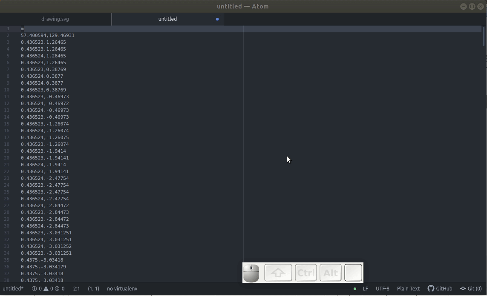

|

#########################################
Extract data from figures using Inkscape
#########################################

.. .. sidebar:: title
..
..     .. container:: cc
..
..         .. image:: https://i.creativecommons.org/l/by/4.0/88x31.png
..             :target: http://creativecommons.org/licenses/by/4.0/
..             :width: 80px
..
..         This work is licensed under a `Creative Commons Attribution 4.0 International License`_.
..
..         .. image:: https://i.creativecommons.org/l/by/4.0/88x31.png
..             :target: http://creativecommons.org/licenses/by/4.0/
..             :width: 80px
..
.. .. _`Creative Commons Attribution 4.0 International License`: http://creativecommons.org/licenses/by/4.0/
..

**Carlos Galdino**

Last updated: |date|

.. |date| date::

In this tutorial, we are going to extract data from figures in pdf’s using a vector graphics editor (`Inkscape`_), a text editor (`Atom`_), and a spreadsheet software (`LibreOffice Calc`_). Note that, this method is not bound by this choice of applications and you may use your preferred ones.

As an example, I have created this `dummy pdf article`_ which we will use trough out this tutorial. The example article has figures with graphs using either solid curves or scattered points. Also, half of the figures are in a `vector`_ format and the other half are in a `raster`_ format. Roughly speaking, the main difference between them is that raster graphics (.png, .jpg, ...) are made of pixels, while vector graphics (.svg, .eps, ...) are made of vector Cartesian points. In the figure below we can clearly see the difference between them. Note that, no matter how much you zoom in on the figure below, there is no blur in the vector part. This is what makes vector format perfect for high-quality publication figures or presentation on big screens. Raster images should be preferred mostly when the image is a photograph (sometimes heatmaps are also better presented using raster format).

.. _Inkscape: https://inkscape.org/
.. _Atom: https://atom.io/
.. _LibreOffice Calc: https://www.libreoffice.org/discover/calc/
.. _dummy pdf article: tutorial/article_example.pdf
.. _vector: https://en.wikipedia.org/wiki/Vector_graphics
.. _raster: https://en.wikipedia.org/wiki/Raster_graphics

The figure above is a montage of figures 1 and 3 in the example pdf. Be aware that, we can only extract data from vector images, so there is this other tutorial that will show you `how to convert raster images (graphs) to a vector format`_. Also, we need the figure to be formed by solid lines. If the curves are represented by scattered points, as in figures 2 and 4 in the example article, we have to transform them into solid lines in a vector format.

.. _how to convert raster images (graphs) to a vector format: ../Tutorial_raster2vector/test.html

Step-by-step instructions
=======================================

1. Download, install and open Inkscape.

2. Click and drag the pdf file into Inkscape.

3. Zoom in on figure 1, click over it couple of times until the figure is selected. Then, drag it elsewhere so you can select and delete the everything else.

4. Check if the figure is a "clone". You may check at the status bar down below
after selecting the image. If the image is a clone, with the image selected, go to :code:`Edit > Clone > Unlink Clones recursively`.

.. Note::

    Sometimes, when importing figures from pdf’s, new objects may disappear outside of the “figure area”. I think that is a bug in which the “layers” of the svg file are not formatted properly. If this bothers you, a possible fix is to just add a new layer and ungroup the objects.

    .. image:: 3b.gif
        :target: 3b.gif

    |

5. Use the nodes tool to select all nodes in the curve. Then, with all nodes selected, click in the button add nodes. This will add one extra node between two existing nodes. You may click the add nodes button more than once to increase the number of nodes (in this case twice is enough). Finally, transform all nodes to segment lines by clicking the button :code:`Make selected segments lines`. Sometimes, I notice that to click this button only once do not work (maybe this is something of early versions of Inkscape,), so I like to make segments lines, then make selected nodes symmetric, then making them segments lines again.

6. Check the name of the objected of interest. In this case, the red curve. Click on the curve (you may need to click more then once to select the curve,
because there is a high change the different objects are grouped), then open the Objects dialog in :code:`Object > Objects`. In this case, the name of the red curve is “path16271”.

7. Save the file. I saved as drawing.svg.

8. Download, Install, and open Atom. Or you may use any other text editor as long as it has the ability to find and replace text.

9. Open Drawing.svg in Atom. We may do that by clicking and draging the .svg file to Atom.

10. Find “path1627” in the file (ctrl+f). The object has many attributes, like id, transform, etc… The one we are interested is “d”. This tells us all of the Cartesian points that form the curve. Copy all of the text after “d=” and paste in another file. The shortcut for a new file in Atom is ctrl+n.

.. image:: 7.gif
    :target: 7.gif

11. Find and replace all :code:`spaces` by :code:`\n`, which is a digital representation of a new line. Make sure that :code:`Use Regex` is enabled.

12. Erase the “m” in the first line and give it a quick check to see if it has a pair of number separated by a comma in all rows. These are (x, y) Cartesian coordinates that draw the curve on the screen. The “m” that we just erased was a instruction for how to interpret the following Cartesian points, that stands for “move”. This means that only absolute point is the first one and all of the subsequent points are relative to the previous point at the row above.

    If the instruction is not “m”, we have to be careful about how to interpret the (x, y) coordinates. Other instructions like “l”, which stands for “line”, will also work as “m”. If the first letter is not “m” nor “l” or if you have multiple instructions along the file (letters in other rows other than the first one), go back and do item 5 again. If necessary, `here`_ is a list of other instructions that svg files use to construct paths.

.. _here: https://developer.mozilla.org/en-US/docs/Web/SVG/Tutorial/Paths

13. Save the file as data.txt.

14. Now, before going any further, we need to go back to Inkscape and find the exact (x, y) coordinates of the `first` and the `last` data point. In this example, it is not clear what are the (x, y) values of the first data point, mostly because of the poor number of ticks in the y and x axes.

    There are many ways we can use to find the exact values the data points. Here, I am showing one possible way of how we can do it using `Cross-multiplication`_ and Inkscape. Firstly, use the Belzier tool to draw lines (hold ctrl to make straight lines and use double click to draw the line). If necessary, there are many of tutorials on the internet on how to use this tool. By paying attetion to the size of these lines we are able to transform between spacial coordinates to the “graph units”. Particularly, in this example (see below), we know that 11.964 mm is equivalent to 0.5, therefore, 18.246 is equivalent to 0.7625. This means that the y coordinate of the first data point is 0.7625.

    .. image:: 10.gif
        :target: 10.gif

    If we do the same for the x coordinate of the first data point (see below), we will see that 12.706 mm is equivalent to 5, therefore, 2.532 is equivalent to 0.9964. This means that the x coordinate of the first data point is 0.9968.

    .. image:: 11.gif
        :target: 11.gif

    Finally, if we do the same for the last data point, we will see that its coordinates are roughly (25, 0.0114).

.. _Cross-multiplication: https://en.wikipedia.org/wiki/Cross-multiplication

15. Open a spreadsheet software (in this case LibreOffice Calc). Click and drag
data.txt to the spreadsheet and import data using comma as a separator.

    .. image:: 12.gif
        :target: 12.gif

16. It is useful to rearrange the spreadsheet to look something like the image below. Note that, we have the coordinates of the first and last data point
that we found in item 13. Also, we have two values defined as Delta x and Delta y which are the difference between the value of the last and first data points for x and y, respectively. Cell B10 is just “=B6-B2”, while B11 is “=B7-B3”.

17. Cells D2 and E2 are the only ones that have data points with absolute values. The following rows have relative coordinates. We can make all data points absolute by making the first data point (0, 0) in columns F and G and
use the appropriate formula in the following rows (see below).

18. The data points of columns F and G are in “drawing units” (cm, mm, in, …). By subtracting the value of the last and first data points in these columns we can fill out cells B14 and B15.

19. We must then define the calibration factor that will help us go from “drawing units” to “real units”. The calibration factor for the x coordinate is given by “=B10/B14” while the one for y is “=B11/B15”.

20. The final data points can be found by multiplying each data point by the calibration factor and adding the value of the first data point for the x and y
coordinates (See below).

21. Done! Columns H and I are the x and y values of the data points. The figure below shows a plot of these columns. Finally, we can export these columns to a text file and use it elsewhere.

|

`Go to top`_.

.. _`Go to top`: `Extract data from figures using Inkscape`_

------------

If this was useful to you, send me an Email at `galdino@ifi.unicamp.br`. Also, suggestions and criticism are welcomed.

|

.. container:: cc

    .. image:: https://i.creativecommons.org/l/by/4.0/88x31.png
        :target: http://creativecommons.org/licenses/by/4.0/
        :width: 80px

    This work is licensed under a `Creative Commons Attribution 4.0 International License`_.

.. _`Creative Commons Attribution 4.0 International License`: http://creativecommons.org/licenses/by/4.0/

|
