|

###########################################################
How to *vectorize* raster figures from scientific journals
###########################################################

**Carlos Galdino**

Last updated: |date|

.. |date| date::

    .. container:: cc

        .. image:: https://i.creativecommons.org/l/by/4.0/88x31.png
            :target: http://creativecommons.org/licenses/by/4.0/
            :width: 80px

        This work is licensed under a `Creative Commons Attribution 4.0 International License`_.

.. _`Creative Commons Attribution 4.0 International License`: http://creativecommons.org/licenses/by/4.0/

`Vector images`_ are great for high-quality publication figures or presentations on big screens. In opposition, `raster graphics`_ are great for pixelated images, like photographs. Sometimes, it is useful to convert an image from a raster format (.png, .jpg, ...) to a vector format (.svg, .pdf, ...). There are many ways to do that and I'm gonna show you one simple way to that which works well for images with well defined lines and curves, e. g., graphs.

I have `this dummy pdf`_ article with a few vector and raster figures (we may identify the raster images by their pixelated appearance) that we are going to use in this example. Also, we are going to need a vector graphics editor. Here, I am using `Inkscape`_.

This example is divided in two parts. The first part will show the step-by-step instructions for vectorizing solid curves and the second part will show you how to deal with scattered points.

.. _Vector images: https://en.wikipedia.org/wiki/Vector_graphics
.. _raster graphics: https://en.wikipedia.org/wiki/Raster_graphics
.. _Inkscape: https://inkscape.org/
.. _this dummy pdf: tutorial/article_example.pdf

Step-by-step instructions (solid lines)
=======================================

1. Click and drag the pdf file to Inkscape. See below.

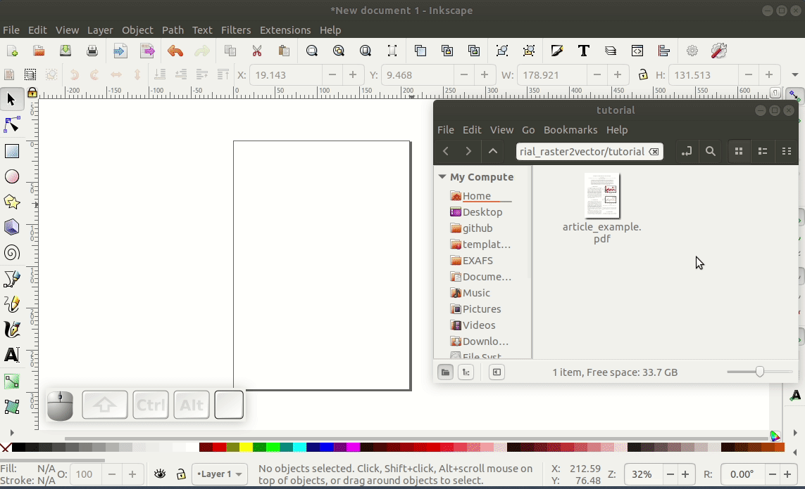

2. With a couple of clicks over the figure you might be able to select it. Click and drag it away from the text and delete everything but the figure.

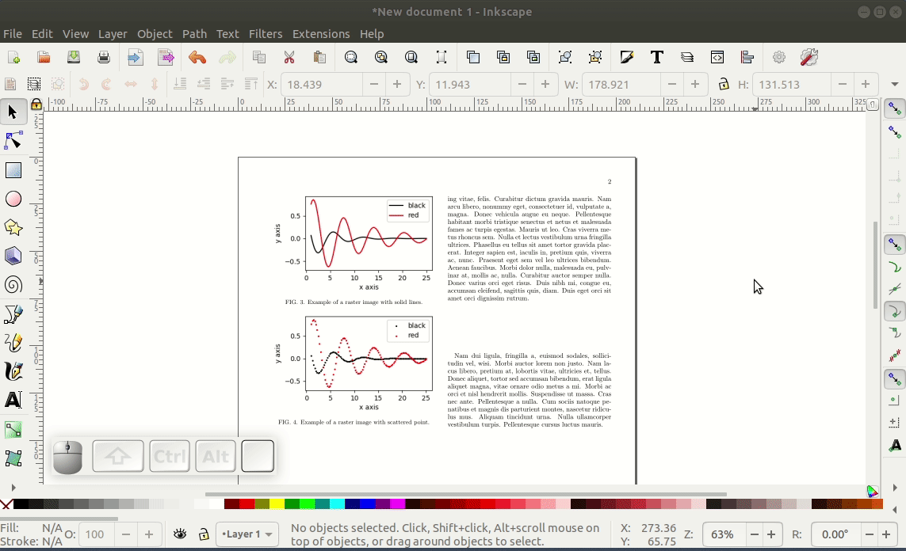

3. Zoom in on the image and create a curve over the lines of the image using the Bezier tool. If you are not familiar with this tool, there are plenty of tutorials on the internet about it. Also, you can use :code:`shift+(mouse scroll)` to scroll sideways.

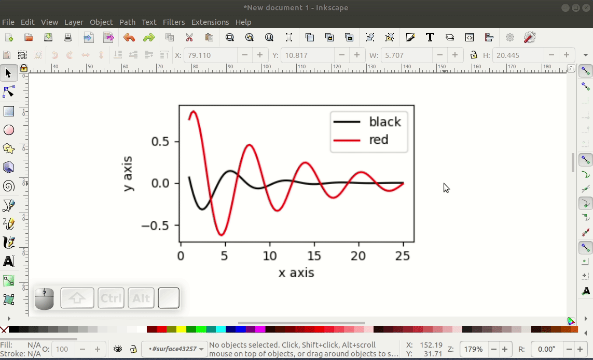

Once you are done, it will look like the image below.

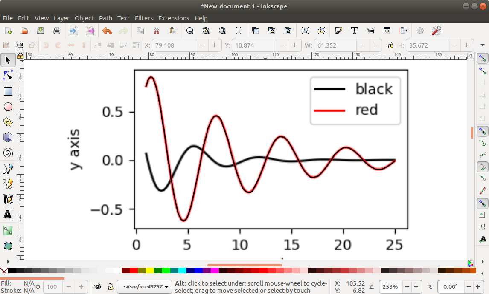

4. Finally, you can do the same for the other lines until you have reached the desired result. Below, I have changed the color of the curve to blue.

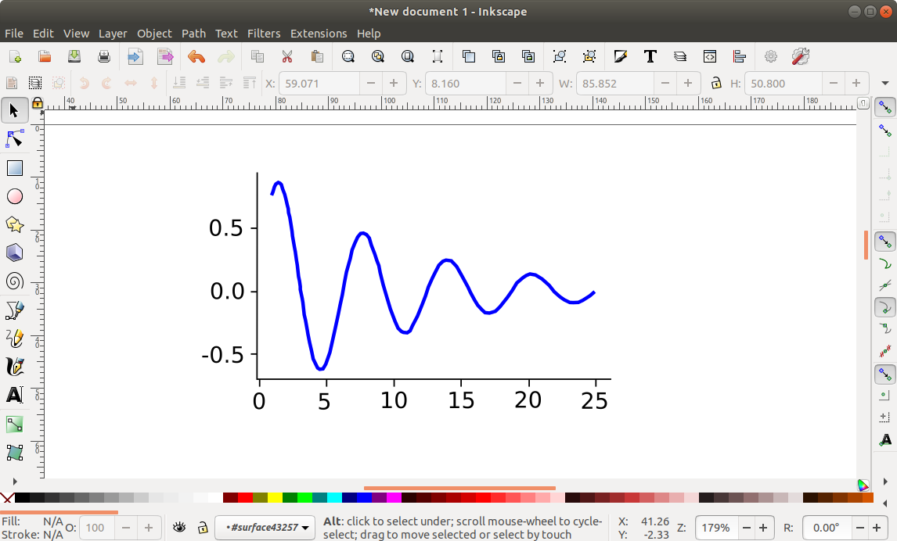

Step-by-step instructions (scattered points)
============================================

1. Click and drag the pdf file to Inkscape. Then, with multiple clicks over the figure with scattered point we are able to select it. Click and drag it away from the text and delete everything but the figure.

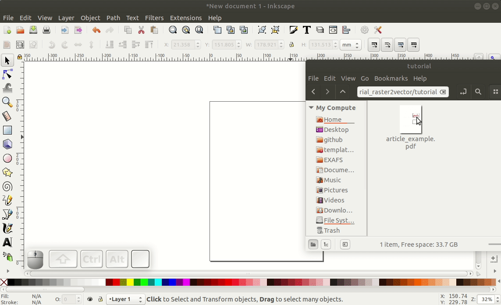

2. Zoom in on the figure and, mark each point with a node using the Bezier tool. See below.

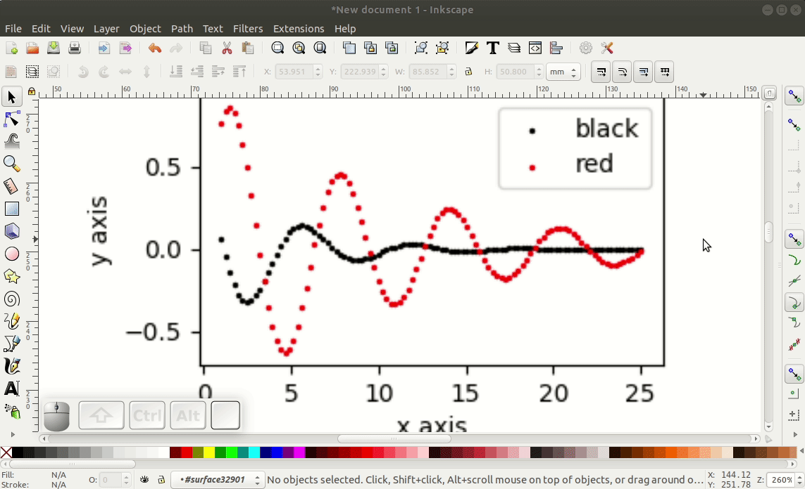

The final result will look something like this:

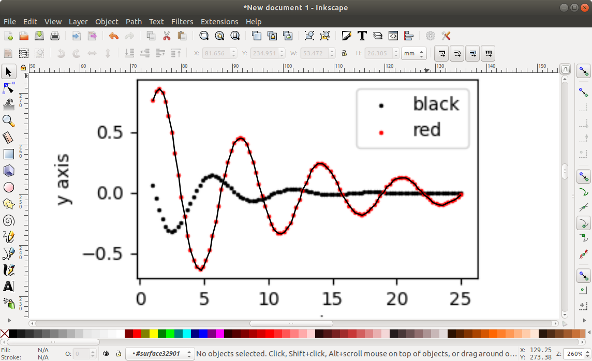

3. To avoid cluttering on the screen we can add another layer and hide the original figure.

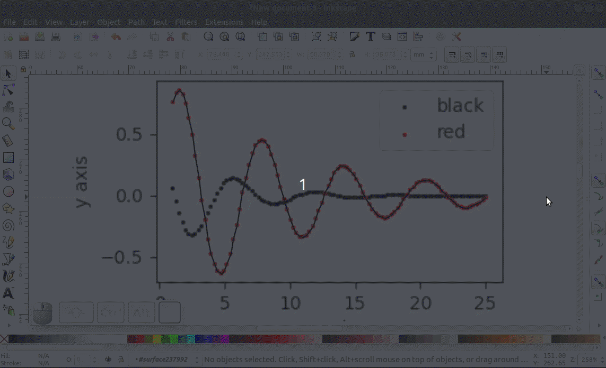

4. Now there are two things we can do: 1) you can extract a x,y list of the positions of the nodes and use a plotting tool to plot this data elsewhere (see this `link`_), or 2) we can use the `generate from path` extension to place objects along the curve (see next step).

.. warning:: The second method does not preserve the original position of the data points.

.. _`link`: ../Tutorial_extract_data_from_articles/tutorial.html

5. Create an object (in this case a small red circle). Click on the red circle and click on `Raise selection to top` to bring the circle above the curve. Then select both the circle and the curve. Got to Extensions > Generate from path > Scatter.

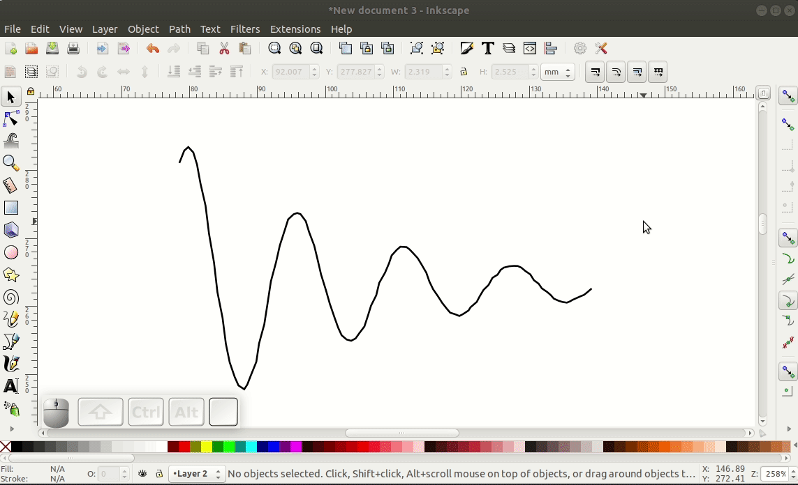

6. Set the options as below and click on the Apply button. If the extension do not work I'd recommend downgrading (or upgrading) Inkscape.

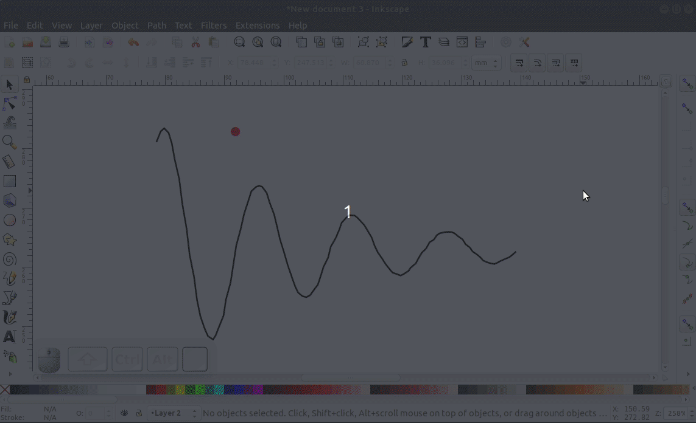

7. Finally, we may delete the original curve.

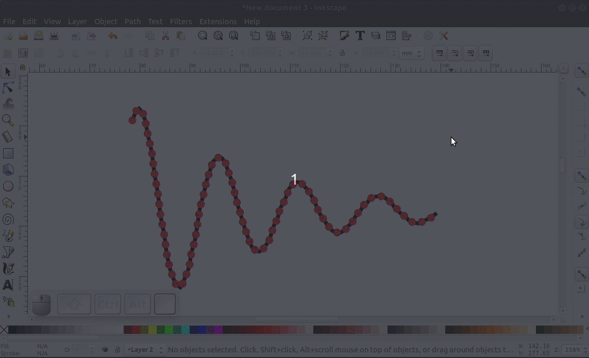

|

`Go to top`_.

.. _`Go to top`: `How to vectorize raster figures from scientific journals`_
