################
Academic writing
################

.. contents:: Table of Contents

General tips
==================

- Do not describe what you have done, but tell a story.

- Care about the reader. Do the work.

- Know your audience (their prior knowledge and expectations).

- Use sentences of variable length, but prefer short sentences (~15 words). Read "This sentence has five words" by Gary Provost.

- Use one verb per sentence and keep it close to the subject.

- Keep modifiers (adverbs, adjectives) close to what they modify.

- Use a more appropriate formal negation form.

    - not many = few
    - not much = little
    - not true = false

- Avoid "of".

    - Ring the bell of the door. (FINE)
    - Ring the door bell. (MUCH BETTER)

- Avoid etc.

    - The objects mass arises from their molar mass, density, volume, etc. (FINE)

    - the objects mass arises from their molar mass, density, volume, and other physical properties. (BETTER)

- Active voice is easier to read. Use passive voice only

    - to highlight certain parts of your sentence.
    - if subject is irrelevant and you want to omit it
    - to avoid first person (for variety)
    - for coherence

- Be precise with the use of the word “only”:
    - I only eat apples (the speaker does nothing but eat apples or the speaker utilize apples only as food in opposition to juice them)
    - I eat only apples (the speaker eats nothing but apples)

- Use *serial comma*.
    - France, Italy and Spain. (NO)
    - France, Italy, and Spain. (YES)

- Use a good dictionary:
    - https://www.macmillandictionary.com/
    - https://dictionary.cambridge.org/us/

- Use a phrase bank
    - http://www.phrasebank.manchester.ac.uk/describing-trends/

- Use an academic word list
    - http://www.victoria.ac.nz/lals/resources/academicwordlist/
    - Ask google for *verbs for scientific writing*

Verbs
==================

- Use active verbs.

    - The lion was behind the tree. (Why was the lion behind the tree? Was he having a nap? Stalking prey? Basking in the sunshine?)
    - The lion hid behind the tree. (Now we have a sentence that adds to the story.)
    - I was rowing the boat. (Sometimes continuous tense weakens writing)
    - I rowed the boat. (active verbs fits better most of the time)
    - https://kathysteinemann.com/Musings/to-be/

- Avoid "Verb + preposition" structure

    - Researchers **looked at** the way electrons **build up** around insulating materials. (INFORMAL)

    - Researchers **observed** the way electrons **accumulate** around insulating materials. (FORMAL)

- Avoid "Verb + to be" structure

    - You **should be asking** her for help. (BAD)
    - You **should ask** her for help. (GOOD)
    - **There is no** method **that is guaranteed to** succeed. (BAD)
    - **No** method **guarantees** success. (GOOD)
    - http://beaconpointservices.org/2018/05/09/8-strategies-to-eliminate-be-verbs/
    - https://kathysteinemann.com/Musings/to-be/

- Always prefer the "cause to effect" structure.

    - the dog running away is a result of the open door (FINE)
    - the opened door caused the dog to run away (BETTER)

Adverb placement
========================

Rule of thumb:

- Before an active verb:
    The Earth’s dry atmosphere *mainly contains* nitrogen.

- After the verb "to be":
    The increase in greenhouse gases *is mainly* a result of humans changing the natural patterns of vegetation and polluting the atmosphere.

- mid-position between the auxiliary verb and the main verb:
    The Earth’s dry atmosphere **is mainly composed of** nitrogen.

Comma
=================

Extended set of rules: https://owl.purdue.edu/owl/general_writing/punctuation/commas/extended_rules_for_commas.html

- Use commas to separate independent clauses when they are joined by any of these seven coordinating conjunctions: and, but, for, or, nor, so, yet.

    - The game was over, but the crowd refused to leave.
    - The dog is young, but he’s well trained.
    - The dog is young but well trained. (no comma)

- Use commas after introductory a) clauses, b) phrases, or c) words that come before the main clause.

    - In many types of solids, something happens...
    - While I was eating, the cat scratched at the door. (Right)
    - The cat scratched at the door, while I was eating. (Wrong, because the second sentence is dependent from the main clause)
    - However, you may not be satisfied with the results.

- Do not surround a symbol with commas or parentheses when it immediately follows the noun that defines it, but do insert the commas or parentheses if another phrase intervenes.

    - As the temperatures approached the melting temperature Tm, all...
    - As the temperatures approached the melting temperature reported by Green et al., Tm, all...

- When inserting a parenthetical remark into a sentence do not punctuate what is within the parentheses (a parenthetical remark or section is put into something written or spoken but is not essential to it).

    - Recall that the Brown-Green theory (see Sec. II below) must still be tested.

- A completely separate parenthetical remark is punctuated as a regular sentence or group of sentences except that everything including the ending punctuation is enclosed within the bracketing.

    - (Recall that the Brown-Green theory is still to be tested.) Again we begin to evaluate...

- Square brackets enclose a phrase that already contains parentheses.

    - Recall that the Brown-Green theory [see Eq. (2)] is still to be...

- Use comma around:

    - etc.
    - e.g.
    - i.e.
    - viz.
    - namely
    - for example
    - that is
    - say
    - in particular
    - respectively

- Do not use commas around:

    - cf.
    - et al.
    - ditto (I am not sure about this one)

.. note::

    Ditto usage:

    - Local residents are opposed to the proposal. Ditto many members of the city council.

    - ... friends don’t let friends use cf. because as long as its meaning hasn’t stabilized, it’s an ineffective tool for communication. Ditto for moot point ...

Paragraph structure (flow and cohesion)
===========================================

Paragraph structure models
------------------------------

    - TEXAS or TEEL  (topic, evidence, explain, link)
    - uneven-u (https://thesiswhisperer.com/2019/02/13/the-uneven-u/)

Thematic progression
-----------------------

**1. Linear progression (zigzag)**

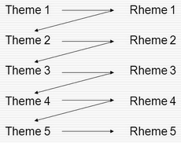

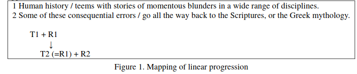

**2. Constant progression**

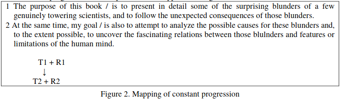

.. Note::

    Types 1 and 2 are said to be "canonical". Linear progression create a "dynamic" style and constant progression a "static" style of writing. Linear progression occur frequently in expository and argumentative texts as constant progression occur frequently in narratives and in news stories.

**3. Theme reiteration (constant theme)**

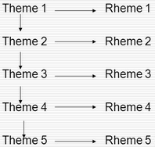

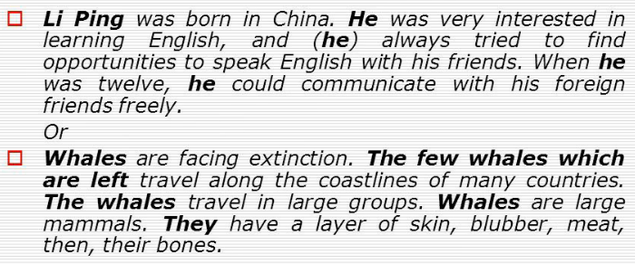

**4. Concentrative progression (constant rheme)**

.. image:: figs/4.png

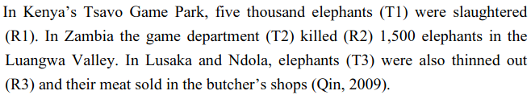

**5. Split rheme progression**

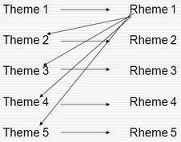

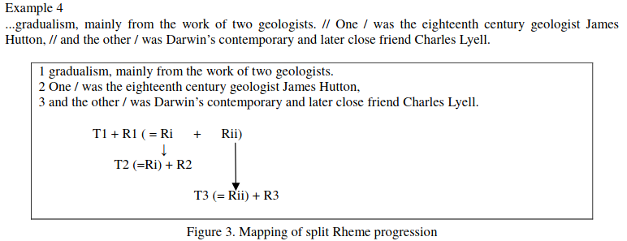

**6. Split theme progression**

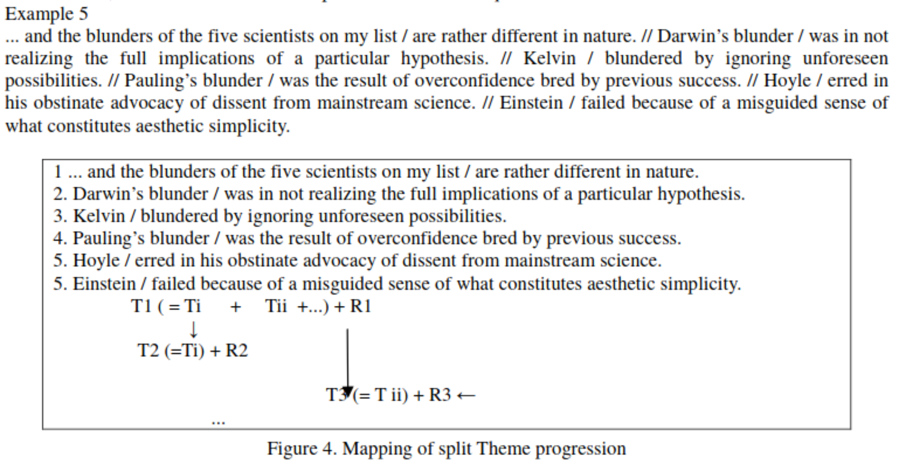

**7. Hyperthematic progression (** Themes in subsequent clauses are derived from a hypertheme or from the same overriding theme.

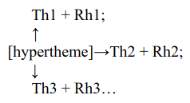

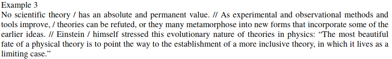

**8. Juxtaposition pattern**

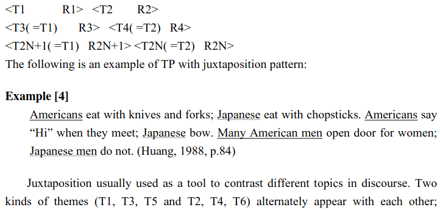

Figures from:
    - https://files.eric.ed.gov/fulltext/EJ1079122.pdf
    - http://ir.nptu.edu.tw/retrieve/20777/13-15-34.pdf
    - https://slideplayer.com/slide/10491267/

Another example (hard): http://www.cc.kyoto-su.ac.jp/information/tesl-ej/ej48/a1.html

Theme types
-------------

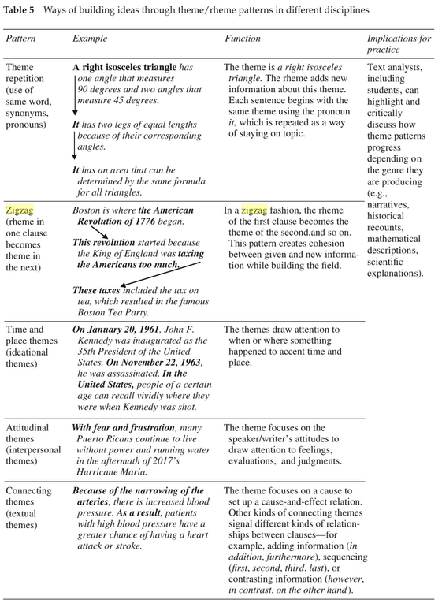

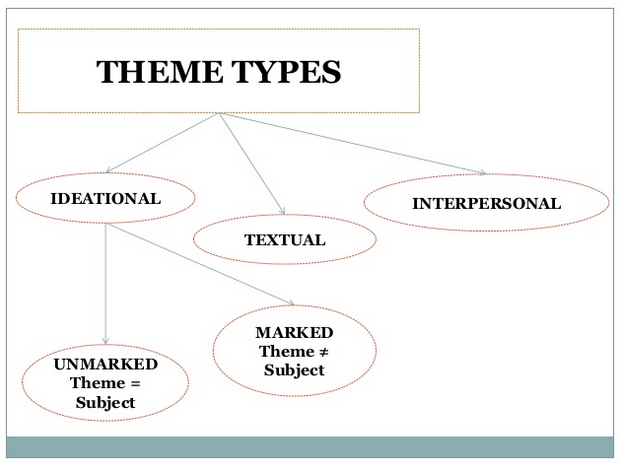

See also,

    - https://pt.slideshare.net/t3nee/20-theme-and-rheme-adip-arifin/3
    - https://www.slideshare.net/septyrianipangindoman/discourse-analysis-and-grammar-48235695

Connective words (cohesive devices)
====================================

Connective words guide the reader. The author is the only person that exactly knows what he wants to express. Do not let your reader doing your job!

Linking back words
-------------------

    - This
    - That
    - It
    - ...

Repetition
------------

Use repetition or synonyms as linking back devices to avoid using this, that, ... (mostly used for variety).

Conjunctive Adverbs
--------------------
A conjunctive adverb is an adverb that has been authorized to perform the function of a conjunction. See example below:

    - Adverbial conjunction: “The settlements are an acknowledgment that our business model is sound; otherwise, we would not have agreed to the terms.”

    - Adverb: "The memory troubled him through the otherwise pleasant afternoon."

Like other adverbs, conjunctive adverbs can be moved to different parts of a sentence because they are not connecting grammatical parts of the sentence; for example,

    - These words are call adverbs; however, they feel like conjunctions.

    - These words are call adverbs; they feel, however, like conjunctions.

Conjunctions
-------------

    - Coordinating conjunction

        A coordinating conjunction is a word that joins two elements of equal grammatical rank and syntactic importance. The seven coordinating conjunctions are **for**, **and**, **nor**, **but**, **or**, **yet**, and **so** (FANBOYS). When starting a sentence with a coordinating conjunction do not use a comma after the coordinating conjunction. Coordinating conjunctions are not transitional expressions like for example or first of all. You will rarely use punctuation after them.

    - Subordinating conjunction (https://www.bbc.co.uk/bitesize/topics/zwwp8mn/articles/zqk37p3)

        A subordinating conjunction is simply the word/words that is used to join a subordinating clause to another clause or sentence. (A subordinate clause is a clause that cannot stand alone as a complete sentence). Examples: **although**, **because** or **when**.

    - Correlative conjunction

        Correlative conjunctions are pairs such as **neither/nor**, **both/and**, and **not/but**. These conjunctions connect two balanced clauses, phrases, or words. The two elements that correlative conjunctions connect are usually similar in length and grammatical structure.

**Extended lists of cohesive devices**

    - https://www.grammarbank.com/connectives-list.html
    - https://emedia.rmit.edu.au/learninglab/content/common-linking-words-0
    - http://www.lousywriter.com/cheat-sheet-most-popular-connective-words.php

Articles
============

- uncountable

    - this one exactly: **The**
    - one of many: nothing
    - All of them everywhere: nothing

- countable (plural)

    - this one exactly: **The**
    - one of many: nothing
    - All of them everywhere: nothing

- countable (singular)

    - this one exactly: **The**
    - one of many: **a/an**
    - All of them everywhere: **the**

Apostrophe s
=============

- Noun not ending in s
    - John's hat
    - Woman's hat

- Common noun ending in s
    - The class's hour
    - Boss's wife

- Proper noun ending in s
    - Texas' weather
    - Mr. Jones' size

- Plural noun ending in s
    - Guys' night out
    - Two actresses' roles

- Two nouns
    - Cesar and Maribel's home
    - Maribel's and my home
    - Cesar's and Maribel's home are both lovely

- To form the plural of numbers add s (1980s), to symbols add ’s (A’s), and to abbreviations add ’s or s (NMR’s or NMRs). This suggestion might change from journal to journal.

.. Note::
    Some journals suggest that, to form the possessive of names add ’s (apostrophe s), regardless of the number of syllables or final letter (Green’s, Jones’s, de Gennes’s). See APS style guide: https://cdn.journals.aps.org/files/styleguide-pr.pdf

Latin abbreviations
====================

**Latin words and abbreviations should not be italicized**

- , i.e.,   = that is
- , e.g.,   = for example
- , etc.    = and so on, and so forth.

    Example: Students ranked their school subjects (chemistry, math, etc.) in

- , viz.,   = namely

    Example: We first replicated our earlier study (viz., Black & Avery, 2008) and then extended it.

- cf.       = bring together, compare (do not use commas around cf.)

- et al.    = and others (do not use commas around et al.)

.. note::
    APA style: cf, eg, etc, ie, viz, and vs must be used only inside parenthesis.

Dashes
========

See https://7esl.com/em-dash/

- hyphen (-)

    - Avoid hyphens that serve no useful purpose, e.g.,cutoff, not cut-off; output, not out-put.

    - Prefixes and suffixes usually should be closed up (nonradioactive); but do not close them up if a double letter is produced (semi-infinite), when added to a proper noun (non-Fermi), when added to two or more words (non-time-dependent), or if closing up could change the meaning of the word (un-ionized).

    - "Self" words, “free” words, and some “half” words should be hyphenated (self-consistent, worry-free, and half-life), but “like” words are closed up (spacelike) unless they become extremely long or cumbersome.

    - Chemical prefixes and suffixes should be hyphenated (cis-dimethylethylene)

    - Numbers above 10 should be hyphenated (11-fold, but twofold).

    - A hyphen also can be used as a sorting agent in predicate adjectives of three or more words (...is face-centered-cubic).

    - Use a hyphen in written-out numbers of two words or more (twenty-five)

    - To prevent ambiguity and make reading easier, modifiers made up of two or more words can be hyphenated (wrong-signature points, 8-MeV data).  Strings of modifiers can be sorted with a combination of hyphen and en dash (two-particle |--| two-hole configuration). Editorial policy varies on this subject from journal to journal.

- en dash (|--|) https://www.thepunctuationguide.com/en-dash.html

    - Indicate a range of numbers. "He lived in this town from 1998 |--| 2009."

    - Express period of time. "You could choose 2 numbers from 1 |--| 50."

    - Used with scores. "The red team won 3 |--| 1 in this match."

    - Indicate distance. "Europe |--| Usa is a long flight."

.. note::
    The en dash is typically used **without spaces** on either side.

- em dash (|---|) https://www.thepunctuationguide.com/em-dash.html

    - Show a break in a sentence. "Pleas call my supervisor |---| John Wick |---| on Friday."

    - Marking on unimportant words. "To get to New York from here |---| you are heading there, right? |---| you need a car or a train."

    - Create emphasis. "My mom loves fish |---| my dad loves beef."

    - Indicates a sudden change of thought. "I had a great vacation in Bali  |---|  oh! Is that your dog? He is so cute!"

.. note::
    The em dash is typically used **without spaces** on either side, and that is the style used in this guide. **Most newspapers, however, set the em dash off with a single space on each side.**

.. |--| unicode:: U+2013   .. en dash
    :trim:
.. |---| unicode:: U+2014  .. em dash, trimming surrounding whitespace
    :trim:

Use of the colon
==================

- Phrases introduced by a colon do not begin with a capital letter.

    - Furthermore, the lake has a natural noise center source: a dam.

- A complete sentence introduced by a colon may be, but need not be, capitalized.

    - Finally, the energies of bound surface states are calculated by means of the “effective-Hamiltonian” technique: Let :math:`H_eff` be defined by :math:`E−H_eff=G_0(E^{−1}−V)`. (Right)

    - Finally, the energies of bound surface states are calculated by means of the “effective-Hamiltonian” technique: let :math:`H_eff` be defined by :math:`E−H_eff=G_0(E^{−1}−V)`. (Right)

- When more than one sentence is introduced by a colon capitalize the first word.

    - In order to tackle Eq. (A5) we introduce the following simplifications and approximations: (1) Each eigenmode in the band is excited by white noise. (2) No eigenmode beyond the band is excited. Because the ...

- Do not use a colon after a form of the verb “to be” or between a verb or a preposition and its object.

    - The momenta of the three α particles in the c.m. system are: p1, p2, and p3. (Wrong)

    - The momenta of the three α particles in the c.m. system are p1, p2, and p3. (Right)

Text and math as sentences
===========================

- Treat the text and mathematical formulas as an entity. Punctuate mathematical expressions as sentences or parts of sentences.

- Avoid beginning a sentence with a symbol if the sentence before it has ended with a symbol or number.

- There are two alphabets used conventionally: Greek and Latin (upper- and lowercase letters of each) in lightface and boldface.

    - The two main Latin fonts, roman and italic, are used to create a distinction between words and mathematical symbols (use italics for mathematical symbols)

    - Boldface type is typically reserved for indicating three-vectors and  in some special cases matrices.

- Greek alphabet
    - some variables and constants
    - symbols for particles
    - some operators, and some units of measure.
    - Note here that the Greek letter, not the word, is commonly used in most situations.
    - lowercase letters are typically italicized while capital Greek letters typically stand upright but can also be italicized.

.. note::

    - In general, mathematical symbols are written in italics. Letters from the Latin alphabet used as mathematical symbol must be italicized. On the other hand, Greek letters are "naturally" italicized and may be freely used as mathematical entities (this is true for LaTeX).

    - In LaTeX, capital Greek letters may be italicized if necessary, but lowercase letters will need special packages to stand upright.

- The Latin alphabet is available in five letter type fonts: roman (upright), italic (slanted), script(cursive), German (Fraktur), and sans serif (unadorned).

    - Latin Roman upright:
        - most multiletter operators and functions (e.g., exp, ln, sin, cos)
        - chemical symbols and compounds
        - units of measure
        - bold three-vector notation (e.g., **k**)

    - Latin Roman *italic*:
        - foreign words
        - words or phrases that indicate emphasis
        - variables
        - constants
        - symbols for particles
        - most single-letter operators (e.g., *e*)
        - axes and  planes,
        - types (e.g., *n*, *p*), bands
        - geometric points
        - angles
        - lines
        - chemical prefixes
        - symmetry designations
        - transitions
        - critical points
        - quantum-state symbols in spectroscopy
        - most single-letter abbreviations (e.g., *e*)
        - in an alloy, the major constituent is italicized, the other chemical symbol is roman as usual, e.g., :math:`Cu\mathrm{Mn}`.

    - Script (cursive) font
        - variables  and  operators
        - constants
        - matrix elements
        - and some quarks

    - German (Fraktur) font
        - variables.

    - Sans serif (unadorned) font
        - a few variables (S, T in tensor notation)
        - shapes (e.g., in "L shaped" the L must be Sans serif)
        - and a few operators

    - See sec. IV. A. 1 in the APS style guide: https://cdn.journals.aps.org/files/styleguide-pr.pdf

- When the argument of a function contains parentheses, enclose it in **bold** round parentheses, i.e.,

.. math::
    g\boldsymbol(x^2a^{3/2}(\alpha_1+\alpha_2)^{−1/2}\boldsymbol).

- This :math:`H_2^+` is different from this :math:`{H_2}^+` and they have different meaning.

- Abbreviations in subscripts and superscripts fall into two categories:

    - single-letter

      Most single-letter abbreviations are conventionally printed in the italic font, i.e., :math:`E_C` where C stands for Coulomb.

    - multiletter

      - Multiletter abbreviations are conventionally printed in the roman font whether they represent one or more words, i.e., :math:`E_{\mathrm{lab}}`, where lab stands for laboratory (truncated word—lowercase) and :math:`E_{\mathrm{HF}}`, where HF stands for Hartree and Fock (acronym), two propernames.

- Please note that you should always capitalize abbreviations that represent proper names.

- If an equation is a variant of a previous equation (it may be separated from the original equation by other equations and/or by text), it may be numbered with the same number as the original and a prime, double prime, etc., as appropriate (one prime means first variation, double prime means second variation, etc.).

- For the purpose of grouping, the sequence of bracketing preferred for Physical Review articles is {[()]}, working outwards in sets ( ), [ ], and{ }. If you have used these three sets and need additional bracketing, begin the sequence again in the same order but in bold print.

- Note that some brackets have specialized meaning in certain context, e.g., Plane or set of parallel planes in crystallography (111) or point designated by coordinates (x,y,z).

- Note the difference between :math:`\approx` (approximately equal) and :math:`\sim` (asymptotically equal)

Units
=======

- The combination of prefix and unit symbol is treated as a single symbol. For instance, such a combination can be raised to a power, i.e., cm2.

- Most symbols for units are printed in lowercase roman type without periods. Units derived from proper names, however, are written with initial capital letters,i.e., coulomb (C), weber (Wb).

- 10 cm and not 10 centimeters. However, "a few centimeters" is right while "a few cm" is wrong.

- The number (numeral) is separated from the unit following by a full space, e.g., 1.8 MeV. Some will prefer that the space between the two should be a thin space ("10\\,m" in LaTeX), but that is required only if the journal specifies it.

- The space between the number and the unit must be nonbreaking ("10~m" in LaTeX).

- The unit is not italicized.

- Prefixes that make the unit BIGGER (mega, giga, etc.) should be capitalized, with the historical exception of “k”, “h”, and “da”.

- Some units are not spaced off from the number, e.g., 1%, 1 |deg| , and 1 |deg| C.

.. |deg| unicode:: U+00B0
    :trim:

Tips on typography
====================

- Where to use nonbreaking spaces:

    - If space is used between the text and the citation, use a nonbreaking space

        - text text text~\\cite{Foo2000}

    - Between text and references

        - text text text~\\ref{...}

    - Between a person's forenames and between multiple surnames

        - Dr.~Faust
        - Donald~E

    - in units and in expressions in which figures and abbreviations (or symbols) are separated by a space

        - 17~kg
        - AD~565
        - 2:50~pm
        - £11~billion
        - 5 |deg| ~24'~21.12"~N
        - World War~II

    - Between math symbols in apposition with nouns

        - dimension~$d$
        - function~$f(x)$

    - When mathematical phrases are rendered in words

        - equals~$n$
        - less than~$\epsilon$

    - When cases are being enumerated within a paragraph

        - (b)~Show that $f(x)$ is (1)~continuous; (2)~bounded.

    - If space is used between the text and an en dash, use a nonbreaking space.

- Interword spaces:

    - TeX assumes a period ends a sentence. So, put a \\_ (where _ means “space”) in a sentence like:

        Smith et al.\\ say that...

    - TeX assumes that a period do not end a sentence if an uppercase letter precedes the period. So use \\@ before the period:

        In the class, I gave Bob a C\@. Therefore, ...

- Use small capitals to identify computer program names, designation of ionization states in atomic spectroscopy, and the names of logical operations; e.g., DWUCK, Fe II, and OR. See APS style guide: https://cdn.journals.aps.org/files/styleguide-pr.pdf

.. note:: TeX command for small caps is \\textsc{...}.

Figures
========

- Label parts of figures (a), (b), (c), etc.; curves A,B,C, etc.; geometric points, angles, and lines A, B, C, etc.; or a,b,c, etc., as appropriate. See APS style guide: https://cdn.journals.aps.org/files/styleguide-pr.pdf

- Treat graphs so that they are completely self-explanatory.

Style instructions for parts of a manuscript
===============================================

Title
------

- Your title is critical. In less than 100 characters, provide a quick summary of the paper. Include enough details for specialists but be simple enough for non-specialists to understand.

- State what has been shown, not what has been done.

- Make sure your title contains the main message.

- Avoid *the*, *an*, *study*, *investigation*, or anything that fills up space without communicating new information.

- Identify the importance of each word.

- Build at least 5 different title, than pick one.

- The beginning and the end are the most import part.

- Use colon (:) to "reboot" the reader's attention.

- Avoid chemical formulas (due to search engines).

- Think about how *search engines* will search for your article.

Abstract (for events)
------------------------------

- Introduction [general context (what do you tell to non-experts) and specific context (what you tell to your colegues)].

- Problem to be solved and solution proposed

- Objective (only one objective and very specific)

- Methodology (main parameters)

- Results (what was found)

- Discussion (what the results found mean, comparisons, perspectives)

- Conclusion and/or Perspectives

Abstract (for articles)
------------------------

- An effective Abstract is a global paragraph that prepares the reader for the rest of the document. Write it with all audiences in mind so the reader can decide if the paper is of interest. Include a foreword (a description of the "need" for your research), the context (what the reader needs to know to understand the need for the research), a summary (what you did to solve the problem), a conclusion (an interpretation and/or recommendation based on the findings); and perspectives (what needs to be done in the future).

- Structure your abstract to attract ‘non-specialist’ readers. A paper that is attractive to ‘non-specialists’ will be read (and cited) by experts in other fields.

Introduction
------------

The Introduction follows the abstract. Provide some context to orient the audience and establish your work’s importance. State the need for your work with respect to what the scientific community currently has and what it wants. Indicate how you have addressed the need. Preview the rest of the paper to prepare readers for its structure and the object of the paper.

- General context (background information for non experts)
- Specific context
- problem to be solved
- solution proposed
- objective
- Verb tenses (very flexible, but below is a little guidance)

    - present: Accepted facts
        The photons travel at light speed.
    - present continuous: temporary truth
        The photons are traveling at light speed.
    - past: important in the past
        The photons traveled at light speed.
    - present perfect: important now
        The photons have traveled at light speed.

Methodology
--------------

Describe how you obtained the results. Include experimental methods, materials, the development of theory, device design, modeling tool development, and more. Provide enough details so other researchers can validate your conclusions.

- Verb tenses (very flexible, but below is a little guidance)

    - present (active or passive): Common procedure and equipment description
    - past (active or passive): your own actions. Your contribution to the experiment.

Results
-------------

- Figures, graphs, images
- Present results without any kind of "bias"

Discussion
-----------

Results and Discussion follow with an explanation of your results. Show how the results answer the research questions posed in the Introduction. The discussion flows from summarizing, interpreting, and explaining the results, whether they were expected or unexpected, comparing them to previous work, and hypothesizing about their generality.

Explicit the connections between observations:

    - Clear/strong causal connection: cause, produce, yield, arise from
    - Partial cause: contribute to, be a factor in, affect
    - First cause in a causal chain: initiate, generate, originate in
    - Weak causal connection: be related to, be associated to, be connected to

Conclusion
-----------

In a short Conclusion, state the most important outcome of the work and interpret the findings—don’t simply summarize. Report your success in addressing the need stated in the Introduction and include perspectives. This could be your plans for future work on the subject, or an invitation to readers to investigate something additional.

|

|
